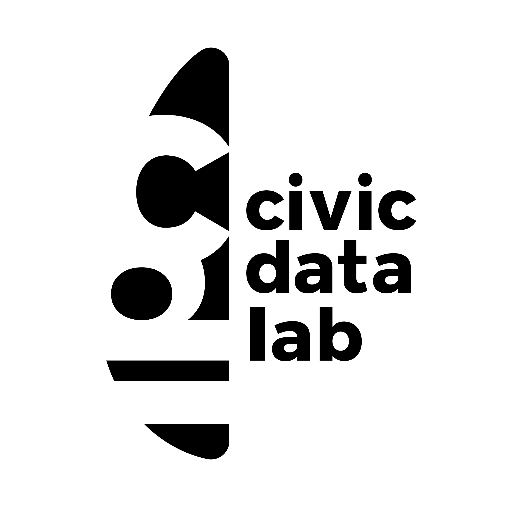
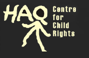

### POCSO law implementation tracker

---

[Read more](https://www.notion.so/Child-Rights-Law-Implementation-Tracker-5ea2d8e7d33c4e2a9b69727a556523d3) about the project

### Other Links

- https://haqcrc.org/publication/implementation-pocso-act/
- https://www.agami.in/data-challenge-2019

### Partners

 

